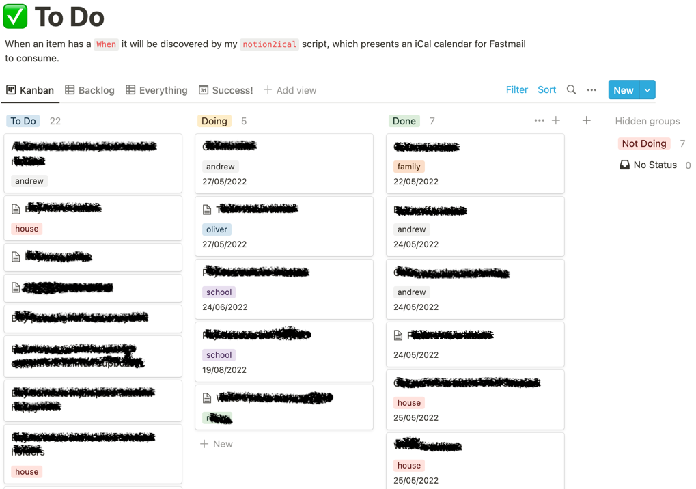
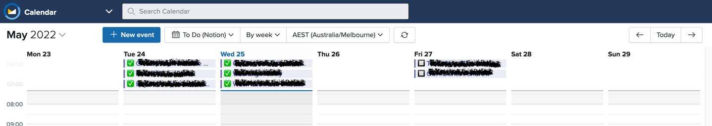

# notion2ical

A small script that, when called, will interrogate a Notion database and return all of the items in iCal format.

This allows you to add an iCal calendar to your regular Calendar app (Google, Apple, Outlook, etc) and the events are items that are taken from your Notion database. As you make changes in Notion, the events in the calendar will change automatically.

My Notion database is a Kanban board. The properties that are important to this script are:

* `Title` is the title of the task and is used for the title of the event.
* `Status` is a select property and the important values are "Doing" and "Done". These determine if they should be included in the calender, and if they should show an empty checkbox (Doing) or a checked checkbox (Done).
* `When` is a date property and is used to determine the day.
* `Tags` is a multi-select property and a way to add hashtags to the end of the event.

Here is a screenshot of Notion database:



Here is a screenshot of my calendar app showing the calendar that was generated by this script:



## Pre-requisites

I wrote this using PHP 8.1. It would probably work with PHP 8.0, I'm not sure.

You need to have (Composer)[https://getcomposer.org/download/] installed.

## How to use it

### Install

```shell
git clone https://github.com/andrewbrereton/notion2ical.git
cd notion2ical
composer install
```

### Configure environment variables

Create your .env file from the example provided:

```shell
cp .env.example .env
```

Open [.env](.env) file to set the values for each variable.

* `GITHUB_PERSONAL_ACCESS_TOKEN`: Create a new GitHub token for this app to use https://github.com/settings/tokens/new
* `GITHUB_GIST_ID`: Create a new Gist and record its ID https://gist.github.com/
* `NOTION_KEY`: Follow this guide to create the API integration so that it can connect to Notion https://developers.notion.com/docs/getting-started
* `NOTION_DATABASE_ID`: You can get the ID to your Notion database from the URL when you share it https://developers.notion.com/docs/getting-started#step-2-share-a-database-with-your-integration

### Do it!

```shell
php src/notion2ical.php
```

The script will get the most recent 100 items from your Notion database, build up an iCal file, and upload it to your Gist.

### Importing into calendar application

Once the script has been run, your calendar will be available at:

[https://gist.githubusercontent.com/YOUR_GITHUB_USERNAME/GITHUB_GIST_ID/raw/notion2ical.ical](https://gist.githubusercontent.com/YOUR_GITHUB_USERNAME/GITHUB_GIST_ID/raw/notion2ical.ical)

In your favourite calendar tool, there is generally the ability to subscribe to an online calendar. Use the URL above.

### Scheduling update

Executing the PHP script every time you want to update your calendar may become a bit tedious.

I have a cronjob that runs every 5 minutes to ensure the iCal file on my Gist is always up-to-date.

```shell
*/5 * * * * root /usr/bin/php /opt/notion2ical/src/notion2ical.php &>/dev/null
```
